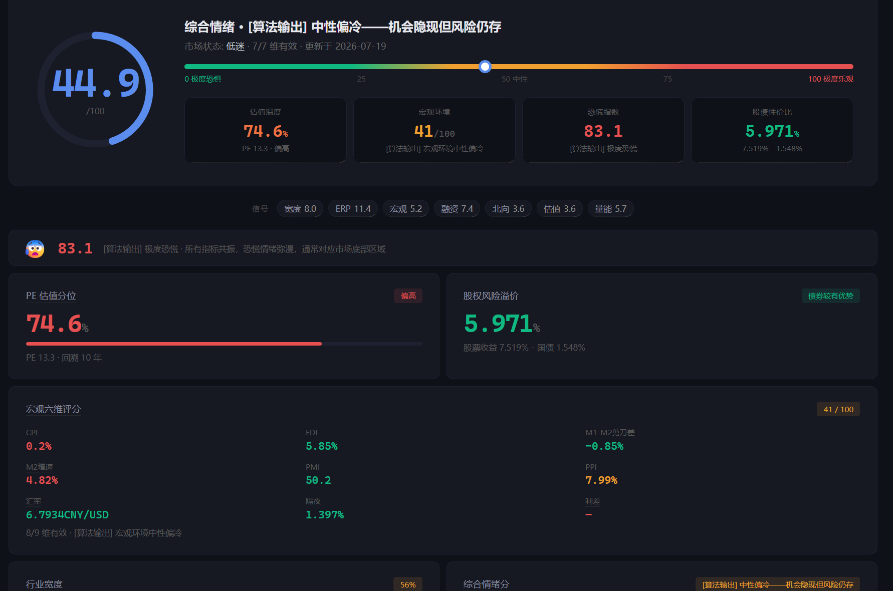

# MarketPulse — A股市场情绪仪表盘

> ⚠️ **重要声明：本项目为技术研究框架，所有分数/标签/解读均由计算机算法基于历史数据自动生成，不构成投资建议、交易推荐或市场预测。作者非持牌投资顾问，项目代码仅供学习交流。市场有风险，投资需谨慎。**

> **21 个量化信号指标，一个 API 全搞定。** 不预测涨跌，帮你看清市场真实面目。



[](https://python.org)
[](https://flask.palletsprojects.com/)
[](LICENSE)
[]()

---

## ✨ 项目亮点

- 🎯 **21 个信号端点** — 估值、宏观、行业、资金面、市场状态五维覆盖
- ⚡ **预计算缓存** — 每日凌晨自动计算，API 毫秒级响应
- 📊 **可视化仪表盘** — ECharts 趋势图 + CSS 热力图 + AI 对话
- 🔐 **四层限速体系** — free/personal/pro/enterprise，按需分配
- 📅 **宏观经济日历** — CPI/PMI/M2/LPR/MLF 等发布日程自动生成
- 📰 **RSS 资讯聚合** — 多源新闻去重缓存
- 🛡️ **合规优先** — 全端点强制注入免责声明，数据来源可追溯

---

## 🚀 快速开始

### 环境要求

- Python 3.11+
- Windows / Linux / macOS

### 安装

```bash
git clone <repo-url>
cd MarketPulse
pip install -r requirements.txt

# 下载数据（首次使用必须）
python scripts/setup_data.py

# 创建管理员 API Key
python scripts/manage_keys.py create --email=admin@example.com --tier=pro

# 启动服务
python api/app.py
# 服务运行在 http://localhost:8898
# 仪表盘: http://localhost:8898/dashboard
```

### Docker 一键部署

```bash
docker-compose up -d
# 访问 http://localhost:8898/dashboard
```

### 第一个请求

```bash
# 健康检查（无需认证）
curl http://localhost:8898/api/v1/health

# PE 分位（需要 API Key）
curl -H "X-API-Key: mp-xxxx" http://localhost:8898/api/v1/signal/pe-percentile
```

```python
import requests

API = "http://localhost:8898"
HEADERS = {"X-API-Key": "your-key-here"}

# 综合情绪分
r = requests.get(f"{API}/api/v1/signal/composite", headers=HEADERS)
print(r.json()["data"]["value"])  # 56.3/100
```

---

## 📊 指标体系（21 个端点）

### 估值维度

| 端点 | 说明 | 数据来源 |
|------|------|---------|
| `/api/v1/signal/pe-percentile` | PE 分位 | 沪深300 PE 历史（5年回溯） |
| `/api/v1/signal/erp` | 股权风险溢价 | PE倒数 - 10年国债收益率 |

### 宏观维度

| 端点 | 说明 | 维度 |
|------|------|------|
| `/api/v1/signal/macro-score` | 宏观综合评分 | M2/PMI/CPI/SHIBOR/利差/汇率/PPI/M1M2/FDI 九维 |

### 市场状态

| 端点 | 说明 | 用途 |
|------|------|------|
| `/api/v1/signal/composite` | **综合情绪分** | PE+ERP+宏观+宽度+融资+北向+量能 七维合成 |
| `/api/v1/signal/panic-index` | 恐慌指数 | 波动率+跌幅+宽度收缩 三维合成 |
| `/api/v1/signal/regime` | 市场状态判定 | 5 档：极寒/偏冷/中性/偏热/过热 |

### 行业维度

| 端点 | 说明 |
|------|------|
| `/api/v1/signal/sector-breadth` | 行业宽度（32行业站上MA60比例） |
| `/api/v1/signal/sector-momentum` | 行业动量排名 |
| `/api/v1/signal/sector-heatmap` | 行业热力图数据（60日动量 + 分组） |
| `/api/v1/signal/sector-crowding` | 行业拥挤度评分 |
| `/api/v1/signal/style-rotation` | 风格轮动（大盘/小盘相对强度） |
| `/api/v1/signal/defensive-ratio` | 防御/进攻比值 |

### 资金面

| 端点 | 说明 |
|------|------|
| `/api/v1/signal/margin-sentiment` | 融资融券情绪分 |
| `/api/v1/signal/northbound-sentiment` | 北向资金情绪分 |
| `/api/v1/signal/volume-score` | 量能活跃度 |
| `/api/v1/signal/liquidity-score` | 流动性评分（SHIBOR/R007） |
| `/api/v1/signal/fund-sentiment` | 资金情绪综合 |
| `/api/v1/signal/lockup-pressure` | 限售解禁压力分 |

### 市场宽度

| 端点 | 说明 |
|------|------|
| `/api/v1/signal/advance-decline` | 涨跌家数比 |
| `/api/v1/signal/new-high-low` | 新高新低比 |
| `/api/v1/signal/cross-asset` | 跨资产对比（股/债/商品） |

### 工具 & 资讯

| 端点 | 说明 | 认证 |
|------|------|------|
| `/api/v1/tool/pe-calculator?pe=12.5` | PE 估值计算器（分位+参考点） | 需要 |
| `/api/v1/tool/similar-period?n=5` | 历史相似期查找（含前瞻表现） | 需要 |
| `/api/v1/calendar/upcoming` | 宏观经济日历·未来 | 需要 |
| `/api/v1/calendar/history` | 宏观经济日历·历史 | 需要 |
| `/api/v1/news/latest` | 市场要闻 | 需要 |
| `/api/v1/ai/chat` | AI 数据助手（DeepSeek） | POST |

---

## 🔑 用户分层

| 层级 | 每秒请求 | 每日配额 | 适用场景 |
|------|:---:|:---:|------|
| **free** | 1 | 50 | 个人学习、试用 |
| **personal** | 3 | 500 | 个人投资研究 |
| **pro** | 10 | 5,000 | 工作室、小团队 |
| **enterprise** | 50 | 100,000 | 机构用户 |

```bash
# 创建不同层级的 Key
python scripts/manage_keys.py create --email=trial@test.com --tier=free
python scripts/manage_keys.py create --email=vip@test.com   --tier=pro
```

---

## 📦 项目结构

```
MarketPulse/
├── api/
│   ├── app.py                  # Flask 主应用（34 个路由）
│   ├── auth.py                 # API Key 认证 + 限速
│   ├── middleware.py            # 统一响应格式 {meta, data}
│   ├── cache.py                # 信号预计算 SQLite 缓存
│   ├── day_reader.py           # .day 二进制文件读取器
│   ├── news.py                 # RSS 新闻聚合缓存
│   └── signals/                # 19 个信号模块
│       ├── pe.py, erp.py       # 估值
│       ├── macro_score.py      # 宏观 9 维
│       ├── composite.py        # 综合情绪 7 维
│       ├── sector.py           # 行业宽度/热度/防御比
│       ├── breadth.py          # 涨跌比/新高新低/动量
│       ├── margin.py           # 融资融券
│       ├── northbound.py       # 北向资金
│       ├── volume.py           # 量能
│       ├── lockup.py           # 解禁压力
│       ├── liquidity.py        # 流动性
│       ├── crowding.py         # 行业拥挤度
│       ├── style.py            # 风格轮动
│       ├── fund_sentiment.py   # 资金情绪
│       ├── cross_asset.py      # 跨资产对比
│       ├── regime.py           # 市场状态
│       ├── panic.py            # 恐慌指数
│       └── calendar.py         # 宏观日历
├── scripts/
│   ├── manage_keys.py          # Key 管理 CLI
│   ├── update_signals.py       # 21 信号预计算
│   ├── update_news.py          # 新闻缓存管理
│   ├── download_data.py        # 宏观数据下载
│   ├── backup_db.py            # 数据库每日备份
│   ├── check_freshness.py      # 数据新鲜度检查
│   ├── daily_task.bat          # 每日任务编排
│   ├── install_scheduled_task.bat   # 注册 Windows 定时任务
│   └── uninstall_scheduled_task.bat # 卸载定时任务
├── tests/                      # 34 个单元测试
├── dashboard.html              # 可视化仪表盘（Vanilla JS + ECharts 趋势 + CSS Grid 热力图）
├── config.py                   # 全局配置
├── requirements.txt
├── .env.example                # 环境变量模板
└── README.md
```

---

## 🗺️ 路线图

### ✅ 已完成 (v2.1.0)

- [x] 21 个信号端点 + 4 个工具/资讯端点
- [x] SQLite 预计算缓存（毫秒级响应）
- [x] 可视化仪表盘（综合仪表 + 行业热力图 + AI 对话）
- [x] 宏观经济日历（CPI/PMI/M2/LPR/MLF/GDP/FOMC 等）
- [x] RSS 新闻聚合 + PE 估值计算器 + 历史相似期对比
- [x] 34 个单元测试
- [x] 每日数据备份 + 自动化脚本
- [x] Docker 一键部署 + docker-compose
- [x] GitHub Actions CI（pytest 自动化测试）
- [x] pyproject.toml（pip install 支持）

### 🚧 进行中

- [ ] API 文档站完善

### 📋 规划中 (v2.2+)

- [ ] WebSocket 实时推送
- [ ] 龙虎榜 / 大宗交易 / ETF 资金流
- [ ] 邮件/微信周报推送
- [ ] CSV 数据导出
- [ ] 截图 + 知乎推广

---

## ⚠️ 合规声明

- 本服务仅提供**衍生指标计算结果**，不提供原始行情数据
- 所有输出不含任何形式的买卖建议、交易信号
- 数据基于公开市场信息经自有算法加工，不对准确性、完整性做担保
- **仅供研究参考，不构成投资建议。据此投资风险自担。**

**数据来源**: 国家统计局 · 中国人民银行 · 沪深交易所公开数据 · 中证指数公司

---

## 📄 许可证

[MIT License](LICENSE) — 自由使用、修改、分发，保留版权声明即可。
